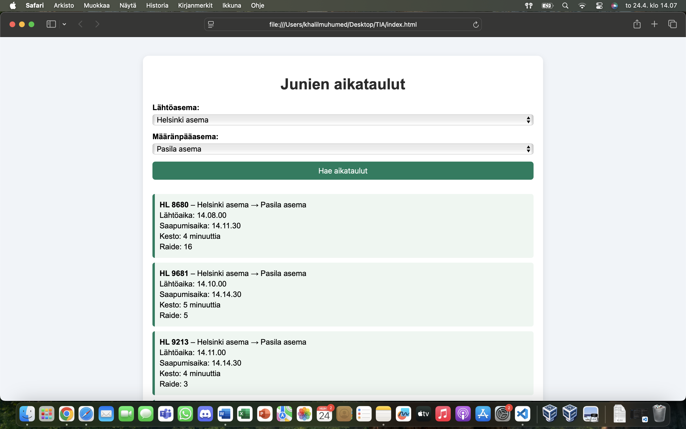

# Junien Aikatauluhaku  
Simple live train timetable application using Digitraffic API  
**Author:** Khalil Muhumed

## Demo link:
Access my site at:  
🔗 [https://your-netlify-link.netlify.app](https://your-netlify-link.netlify.app)

## How was the workload divided
This project was completed individually.  

## Table of Content:

- [About The App](#about-the-app)
- [Screenshots](#screenshots)
- [Technologies](#technologies)
- [Setup](#setup)
- [Approach](#approach)
- [Status](#status)
- [Credits](#credits)
- [License](#license)

## About The App
**Junien Aikatauluhaku** is a web app that allows users to search for real-time train departure and arrival information between selected stations in Finland.  
It uses the Digitraffic API provided by Fintraffic.

## Screenshots

Picture by [Khalil Muhumed]

## Technologies
The following technologies were used:

- `HTML`
- `CSS`
- `JavaScript`
- `Digitraffic REST API`

## Setup

- Open the `index.html` file in your web browser
- No installations or backend server needed

## Approach
- I used the `fetch()` function to make REST API calls to `https://rata.digitraffic.fi`.
- The station list is loaded and added to dropdowns.
- Train data is filtered and sorted by departure time.
- DOM manipulation is done entirely in JS.
- User's last searched route is stored using `localStorage`.

## Status
**Junien Aikatauluhaku** is complete and fully functional.

### Future ideas for development:
- ⏱️ Live update interval
- 🌍 Multi-language support

## Credits
- [Digitraffic API](https://rata.digitraffic.fi)
- [Public APIs GitHub](https://github.com/public-apis/public-apis)
- ChatGPT was used for guidance.

## License
This project is licensed under the **MIT License**.  
More info: [MIT License](https://opensource.org/licenses/MIT)

---

© 2025 – Khalil Muhumed 
